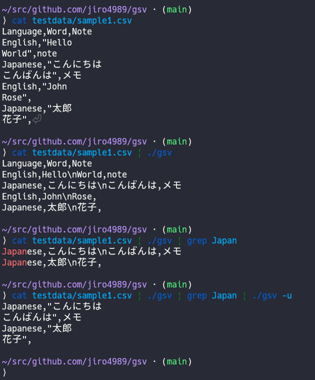

= gsv
:sectnums:
:toc: left

image:https://github.com/jiro4989/gsv/actions/workflows/go-test.yml/badge.svg[test, link="https://github.com/jiro4989/gsv/actions/workflows/go-test.yml"]
image:https://codecov.io/gh/jiro4989/gsv/branch/main/graph/badge.svg[codecov, link="https://codecov.io/gh/jiro4989/gsv"]

`gsv` transforms a multi-line CSV into one-line JSON to make it easier to `grep`.
`gsv` is heavily inspired by https://github.com/tomnomnom/gron[gron].

== Usage

[source,bash]
----
cat sample.csv
cat sample.csv | gsv
cat sample.csv | gsv | grep test
cat sample.csv | gsv | grep test | gsv -u
----

== Installation

[source,bash]
----
go install github.com/jiro4989/gsv@main
----

or download executables from https://github.com/jiro4989/gsv/releases[GitHub Releases].
